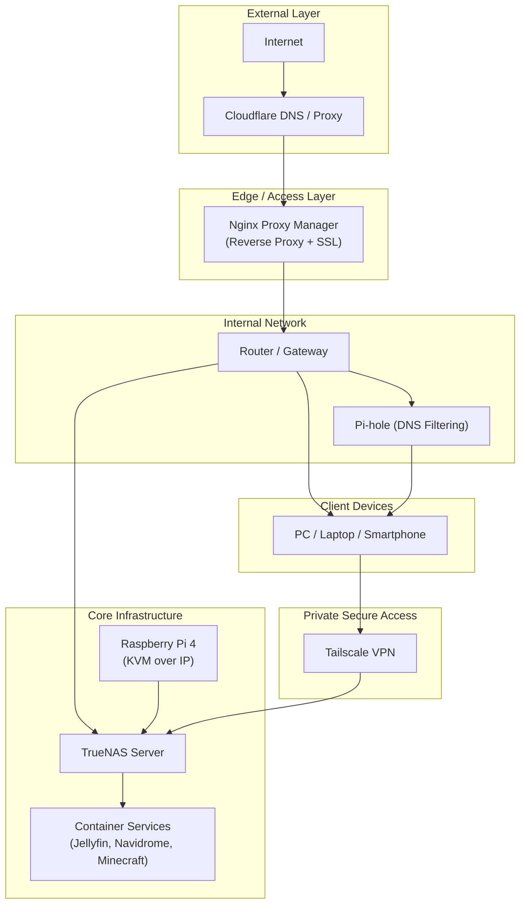

## Network Architecture

```mermaid
flowchart TB

%% ========== EXTERNAL ==========
subgraph External["External Layer"]
    Internet["Internet"]
    Cloudflare["Cloudflare DNS / Proxy"]
end

%% ========== EDGE ==========
subgraph Edge["Edge / Access Layer"]
    NPM["Nginx Proxy Manager\n(Reverse Proxy + SSL)"]
end

%% ========== NETWORK ==========
subgraph Network["Internal Network"]
    Router["Router / Gateway"]
    PiHole["Pi-hole (DNS Filtering)"]
end

%% ========== INFRA ==========
subgraph Infrastructure["Core Infrastructure"]
    TrueNAS["TrueNAS Server"]
    Containers["Container Services\n(Jellyfin, Navidrome, Minecraft)"]
    KVM["Raspberry Pi 4\n(KVM over IP)"]
end

%% ========== CLIENTS ==========
subgraph Clients["Client Devices"]
    Devices["PC / Laptop / Smartphone"]
end

%% ========== PRIVATE ACCESS ==========
subgraph PrivateAccess["Private Secure Access"]
    Tailscale["Tailscale VPN"]
end

%% ========== CONNECTIONS ==========

Internet --> Cloudflare --> NPM --> Router

Router --> TrueNAS
Router --> PiHole
Router --> Devices

PiHole --> Devices

TrueNAS --> Containers
KVM --> TrueNAS

Devices --> Tailscale --> TrueNAS
```
