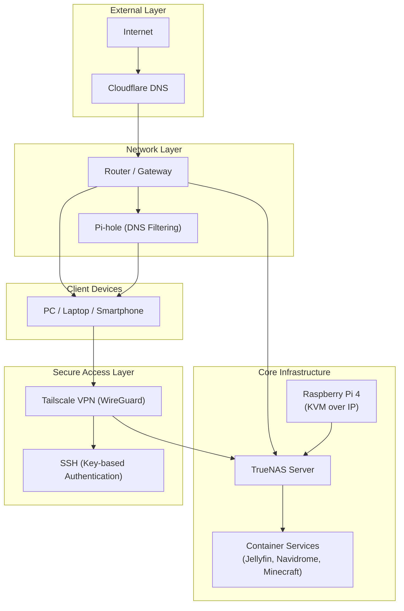

## Network Architecture

```mermaid
flowchart TB
%% ========== EXTERNAL LAYER ==========
subgraph External["External Layer"]
Internet["Internet"]
Cloudflare["Cloudflare DNS"]
end
%% ========== EDGE / NETWORK ==========
subgraph Network["Network Layer"]
Router["Router / Gateway"]
PiHole["Pi-hole (DNS Filtering)"]
end
%% ========== CORE INFRA ==========
subgraph Infrastructure["Core Infrastructure"]
TrueNAS["TrueNAS Server"]
Containers["Container Services\n(Jellyfin, Navidrome, Minecraft)"]
KVM["Raspberry Pi 4\n(KVM over IP)"]
end
%% ========== CLIENTS ==========
subgraph Clients["Client Devices"]
Devices["PC / Laptop / Smartphone"]
end
%% ========== SECURITY / ACCESS ==========
subgraph Access["Secure Access Layer"]
Tailscale["Tailscale VPN (WireGuard)"]
SSH["SSH (Key-based Authentication)"]
end
%% ========== CONNECTIONS ==========
Internet --> Cloudflare
Cloudflare --> Router
Router --> PiHole
Router --> TrueNAS
Router --> Devices
PiHole --> Devices
TrueNAS --> Containers
KVM --> TrueNAS
Devices --> Tailscale
Tailscale --> TrueNAS
Tailscale --> SSH
```
