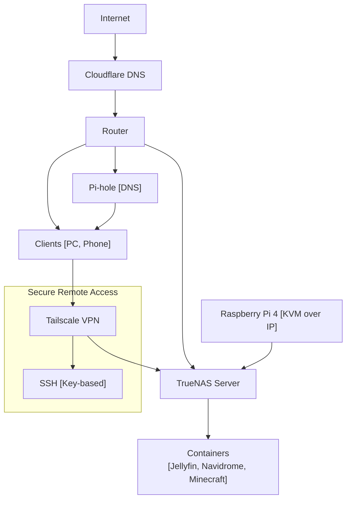

## Network Architecture

```mermaid
flowchart TD
Internet[" Internet"]
Cloudflare[" Cloudflare DNS"]
Router[" Router"]
Internet --> Cloudflare
Cloudflare --> Router
Router --> TrueNAS[" TrueNAS Server"]
Router --> PiHole[" Pi-hole [DNS]"]
Router --> Clients[" Clients [PC, Phone]"]
TrueNAS --> Containers[" Containers\n[Jellyfin, Navidrome, Minecraft]"]
PiHole --> Clients
KVM[" Raspberry Pi 4 [KVM over IP]"]
KVM --> TrueNAS
subgraph RemoteAccess[" Secure Remote Access"]
Tailscale[" Tailscale VPN"]
SSH["SSH [Key-based]"]
end
Clients --> Tailscale
Tailscale --> TrueNAS
Tailscale --> SSH
```
